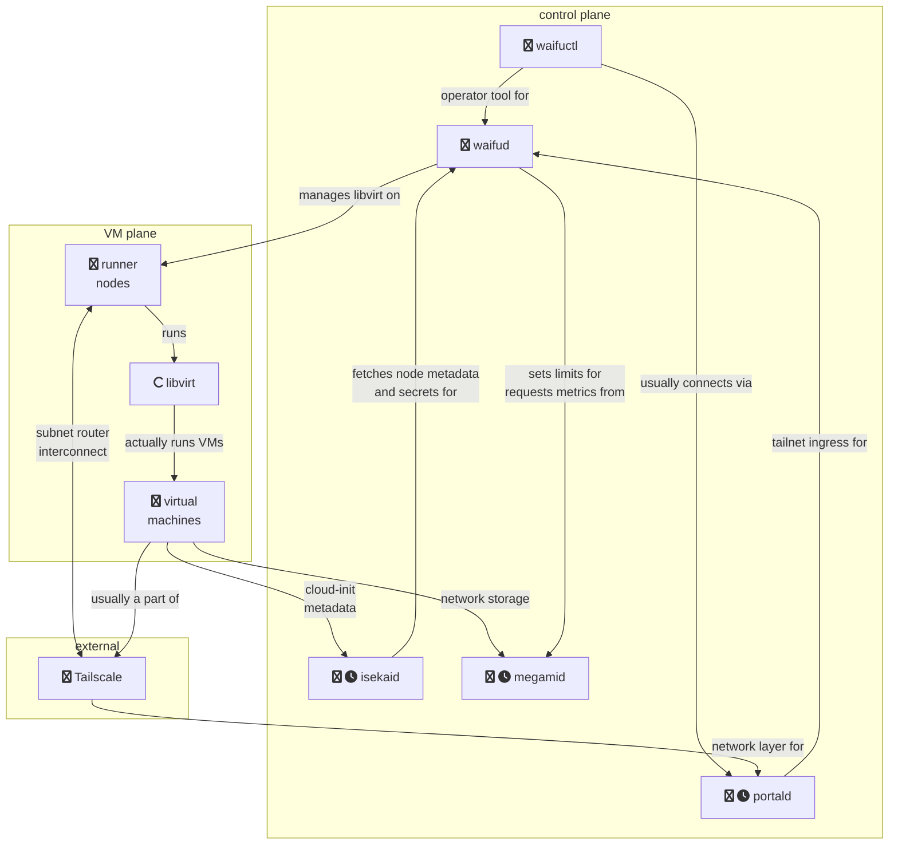

# waifud

A few tools to help me manage and run virtual machines across a homelab cluster.

waifud was made for my own personal use and I do not expect it to be very useful
outside that context. If you do want to run this on your
infrastructure anyways, please [contact me](https://xeiaso.net/contact).

<big>THIS IS EXPERIMENTAL! USE IT AT YOUR OWN PERIL!</big>

TODO(Xe): Link to blogpost on the design/implementation once it is a thing.

Blogposts about waifud:
 - [waifud Plans](https://xeiaso.net/blog/waifud-plans-2021-06-19)
 - [waifud Progress Report #1](https://xeiaso.net/blog/waifud-progress-2022-02-06)
 - [waifud Progress Report #2](https://xeiaso.net/blog/waifud-progress-report-2)

Overall architecture diagram (with incomplete components marked with a
clock):

